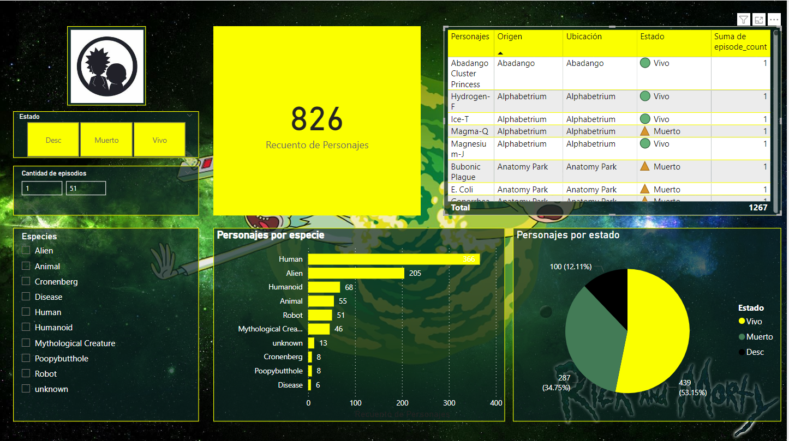

# RickAndMortyAPI_PowerBI_Visualization


Este repositorio contiene un proyecto que consulta datos de la API de Rick and Morty y los visualiza utilizando Power BI. El objetivo del proyecto es demostrar cómo extraer, transformar y visualizar datos de una API pública mediante herramientas de análisis de datos.

## Tecnologías Utilizadas
- **Python**: Para consultar y procesar los datos de la API de Rick and Morty.
- **Pandas**: Para manipulación y limpieza de datos.
- **Power BI**: Para crear visualizaciones interactivas y dashboards.


## Contenido del Repositorio
- [`data_extraction.ipynb`](data_extraction.ipynb): Script en Python para obtener y procesar los datos de la API.
- [`rickandmorty_data.csv`](dataset/rickandmorty_data.csv): Archivo CSV con los datos extraídos y procesados.
- [`PowerBI_Dashboard.pbix`](PowerBI_Dashboard.pbix): Archivo de Power BI con las visualizaciones y el dashboard.

## Cómo Empezar
1. Clona este repositorio:
    ```sh
    git clone https://github.com/ayhovi/RickAndMortyAPI_PowerBI_Visualization.git
    cd RickAndMortyAPI_PowerBI_Visualization
    ```
2. Ejecuta `data_extraction.ipynb` para obtener los datos de la API y guardarlos en un archivo CSV:
    ```sh
    python data_extraction.ipynb
    ```
3. Abre `PowerBI_Dashboard.pbix` en Power BI para ver las visualizaciones interactivas.

## Visualizaciones en Power BI
Aquí hay una vista previa de las visualización creada en Power BI:


*El dashboard principal proporciona una visión general de los personajes de Rick and Morty, detalla la información específica de los personajes, incluyendo su origen, localización actual, y una lista de episodios en los que han aparecido.*

## Ejemplo de Código
### `data_extraction.ipynb`
```python
import requests
import pandas as pd

# URL base de la API de Rick and Morty
base_url = "https://rickandmortyapi.com/api"

# Función para obtener todos los personajes
def get_characters():
    characters = []
    url = f"{base_url}/character"
    while url:
        response = requests.get(url)
        data = response.json()
        characters.extend(data['results'])
        url = data['info']['next']
    return characters

# Obtener datos de los personajes
characters = get_characters()

# Convertir a DataFrame
df = pd.DataFrame(characters)

# Crea una nueva columna 'origin_name' extrayendo el nombre de cada ubicación
# de la columna 'origin', donde cada entrada es un diccionario que contiene una clave 'name'.
df['origin_name'] = df['origin'].apply(lambda x: x['name'])

# Crea una nueva columna 'location_name' extrayendo el nombre de cada ubicación
# de la columna 'location', donde cada entrada es un diccionario que contiene una clave 'name'.
df['location_name'] = df['location'].apply(lambda x: x['name'])

# Contar el número de episodios en los que aparece cada personaje
df['episode_count'] = df['episode'].apply(lambda x: len(x))

# Seleccionar las columnas 'name', 'gender' y 'episode_count'
new_df = df[['name', 'status', 'species', 'type', 'gender', 'origin_name', 'location_name', 'image', 'url', 'episode_count']]

# Exportar el DataFrame con las columnas seleccionadas a un archivo CSV
new_df.to_csv('dataset/rickandmorty_data.csv', index=False)
```

## Contacto:

[](mailto:ayhovi@gmail.com)

[](https://www.linkedin.com/in/emerson-ayhovi-curiñahui-guillermo)